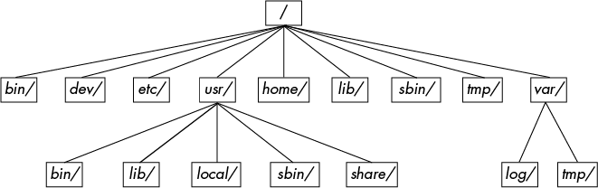

# 2 BASIC COMMANDS AND DIRECTORY HIERARCHY

## 2.1 The Bourne Shell: /bin/sh
A shell is a program that runs commands, like the ones that users enter into a terminal window. These commands can be other programs or built-in features of the shell.

There are many different Unix shells, but all derive features from the Bourne shell (/bin/sh), a standard shell developed at Bell Labs for early versions of Unix. Every Unix system needs a version of the Bourne shell in order to function correctly,

Linux uses an enhanced version of the Bourne shell called bash or the “Bourne-again” shell.

## 2.2 Using the Shell

`$ cat file1 file2 ...`

### 2.2.3 Standard Input and Standard Output

Processes read data from input streams and write data to output streams. the source of an input stream can be a file, a device, a terminal window, or even the output stream from another process. There is a third standard I/O stream, called standard error

## 2.3 Basic Commands
```shell
$ ls
$ ls -l
$ ls -F

$ cp file1 file2
$ cp file dir
$ cp file1 file2 file3 dir

$ mv file1 file2 # mv command can be used to rename or move file

$ touch file

$ rm file # remove a file

$ echo hello world
$ echo $HOME
```
## 2.4 Navigating Directories

```shell
$ cd dir
$ mkdir dir
$ rmdir dir

$ echo * # prints all file in pwd
$ cat * # prints contents of all files in pwd
```

## 2.5 Intermediate Commands

Two of the most important grep options are -i (for case-insensitive matches) and -v (which inverts the search—that is, prints all lines that don’t match). grep understands regular expressions.

When running less, you’ll see the contents of the file one screenful at a time. Press the spacebar to go forward in the file and press b (lowercase) to skip back one screenful. To quit, press q.

```shell
$ grep root /etc/passwd # print all occurrence of string `root` in `/etc/passwd` file
$ grep root /etc/*

$ less /usr/share/dict/words
$ grep ie /usr/share/dict/words | less # connecting stdout of grep to stdin of less

$ pwd

$ diff file1 file2
$ diff -u file1 file2

$ file file_name # Guessing format of the file

$ find dir_name -name file_name -print

$ head /etc/passwd
$ head -5 /etc/passwd
$ tail /etc/passwd

$ sort input_stream
$ sort -r input_stream # reverse order
$ sort -n input_stream # if inputs are numerical
```
## 2.6 Changing Your Password and Shell

Use the `passwd` command to change your password.

You can change your shell with the `chsh` command


## 2.11 Command-Line Editing
```shell
Keystroke	Action
CTRL-B	Move the cursor left
CTRL-F	Move the cursor right
CTRL-P	View the previous command (or move the cursor up)
CTRL-N	View the next command (or move the cursor down)
CTRL-A	Move the cursor to the beginning of the line
CTRL-E	Move the cursor to the end of the line
CTRL-W	Erase the preceding word
CTRL-U	Erase from cursor to beginning of line
CTRL-K	Erase from cursor to end of line
CTRL-Y	Paste erased text (for example, from CTRL-U)

```

## 2.13 Getting Online Help


```shell
$ man ls

$ man -k keyword # $ man -k sort
```

## 2.14 Shell Input and Output

```shell
# STDOUT
$ command > file # write output to file (creates new file if not present, overwrites of already present)
$ command >> file # append mode
$ head /proc/cpuinfo | tr a-z A-Z


# STDERR
ls /fffffffff > f 2> e # write output to f and error to e
# The number 2 specifies the stream ID that the shell modifies. Stream ID 1 is standard output (the default), and 2 is standard error.

ls /fffffffff 1> f 2> e
ls ls /fffffffff > f 2>&1 # send both output and error to same file f


# STDIN
head < /proc/cpuinfo
```

## 2.16 Listing and Manipulating Processes

```shell
ps
ps x

kill pid # Send terminate signal—- a message to a process from the kernel
kill -STOP pid # Freeze a process
kill -CONT pid

gunzip file.gz & # detach a process from the shell and put it in the “background” with the ampersand
ls &
```

```
Some of the more commonly used signals:

1       HUP (hang up)
2       INT (interrupt)
3       QUIT (quit)
6       ABRT (abort)
9       KILL (non-catchable, non-ignorable kill)
14      ALRM (alarm clock)
15      TERM (software termination signal)
```

## 2.17 File Modes and Permissions

# TODO

## 2.18 Archiving and Compressing Files

# TODO

## 2.19 Linux Directory Hierarchy Essentials!


```
Here are the most important subdirectories in root:

/bin Contains ready-to-run programs (also known as executables), including most of the basic Unix commands such as ls and cp. Most of the programs in /bin are in binary format, having been created by a C compiler, but some are shell scripts in modern systems.

/dev Contains device files. You’ll learn more about these in Chapter 3.

/etc This core system configuration directory (pronounced EHT-see) contains the user password, boot, device, networking, and other setup files.

/home Holds home (personal) directories for regular users. Most Unix installations conform to this standard.

/lib An abbreviation for library, this directory holds library files containing code that executables can use. There are two types of libraries: static and shared. The /lib directory should contain only shared libraries, but other lib directories, such as /usr/lib, contain both varieties as well as other auxiliary files. (We’ll discuss shared libraries in more detail in Chapter 15.)

/proc Provides system statistics through a browsable directory-and-file interface. Much of the /proc subdirectory structure on Linux is unique, but many other Unix variants have similar features. The /proc directory contains information about currently running processes as well as some kernel parameters.

/run Contains runtime data specific to the system, including certain process IDs, socket files, status records, and, in many cases, system logging. This is a relatively recent addition to the root directory; in older systems, you can find it in /var/run. On newer systems, /var/run is a symbolic link to /run.

/sys This directory is similar to /proc in that it provides a device and system interface. You’ll read more about /sys in Chapter 3.

/sbin The place for system executables. Programs in /sbin directories relate to system management, so regular users usually do not have /sbin components in their command paths. Many of the utilities found here don’t work if not run as root.

/tmp A storage area for smaller, temporary files that you don’t care much about. Any user may read to and write from /tmp, but the user may not have permission to access another user’s files there. Many programs use this directory as a workspace. If something is extremely important, don’t put it in /tmp because most distributions clear /tmp when the machine boots and some even remove its old files periodically. Also, don’t let /tmp fill up with garbage because its space is usually shared with something critical (the rest of /, for example).

/usr Although pronounced “user,” this subdirectory has no user files. Instead, it contains a large directory hierarchy, including the bulk of the Linux system. Many of the directory names in /usr are the same as those in the root directory (like /usr/bin and /usr/lib), and they hold the same type of files. (The reason that the root directory does not contain the complete system is primarily historic—in the past, it was to keep space requirements low for the root.)

/var The variable subdirectory, where programs record information that can change over the course of time. System logging, user tracking, caches, and other files that system programs create and manage are here. (You’ll notice a /var/tmp directory here, but the system doesn’t wipe it on boot.)
```
### 2.19.1 Other Root Subdirectories
There are a few other interesting subdirectories in the root directory:
```
/boot Contains kernel boot loader files. These files pertain only to the very first stage of the Linux startup procedure, so you won’t find information about how Linux starts up its services in this directory. See Chapter 5 for more about this.

/media A base attachment point for removable media such as flash drives that is found in many distributions.

/opt This may contain additional third-party software. Many systems don’t use /opt.
```

### 2.19.2 The /usr Directory
```
/usr directory may look relatively clean at first glance, but a quick look at /usr/bin and /usr/lib reveals that there’s a lot here; /usr is where most of the user-space programs and data reside. In addition to /usr/bin, /usr/sbin, and /usr/lib, /usr contains the following:

/include Holds header files used by the C compiler.

/local Is where administrators can install their own software. Its structure should look like that of / and /usr.

/share Contains files that should work on other kinds of Unix machines with no loss of functionality. These are usually auxiliary data files that programs and libraries read as necessary. In the past, networks of machines would share this directory from a file server, but today a share directory used in this manner is rare because there are no realistic space restraints for these kinds of files on contemporary systems. Instead, on Linux distributions, you’ll find /man, /info, and many other subdirectories here because it is an easily understood convention.
```
### 2.19.3 Kernel Location
On Linux systems, the kernel is normally a binary file /vmlinuz or /boot/vmlinuz. A boot loader loads this file into memory and sets it in motion when the system boots. (You’ll find details on the boot loader in Chapter 5.)

Once the boot loader starts the kernel, the main kernel file is no longer used by the running system. However, you’ll find many modules that the kernel loads and unloads on demand during the course of normal system operation. Called loadable kernel modules, they are located under /lib/modules.

## 2.20 Running Commands as the Superuser

### TODO